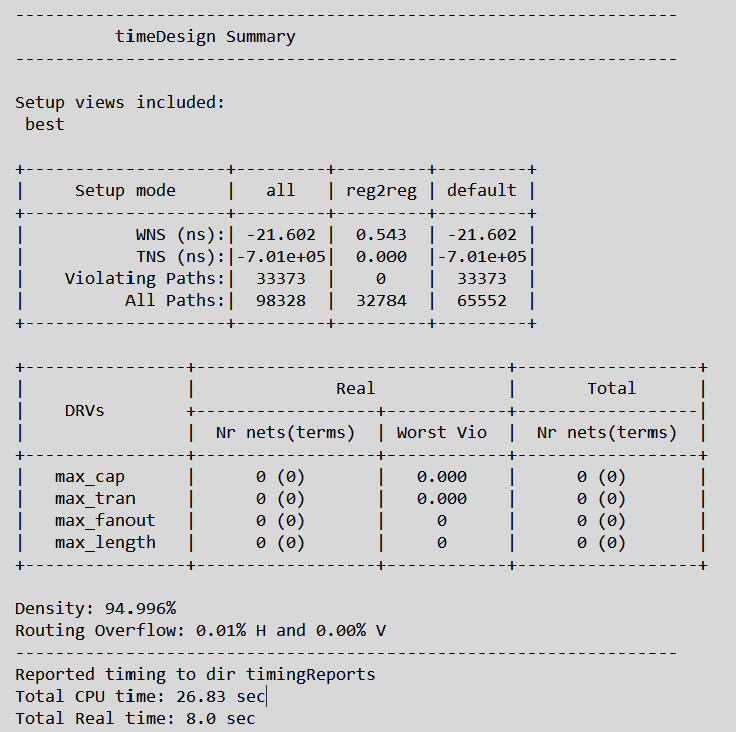

# 🔐 AES-128 Decryption VLSI Project

This repository contains the complete Verilog implementation of **AES-128 Decryption**, including **key expansion**, **inverse S-Box**, **inverse MixColumns**, and a **Finite State Machine (FSM)**-based controller.  
The design integrates all AES operations in a single module for secure hardware-based decryption systems.

---

## 📘 Project Overview

AES-128 (Advanced Encryption Standard) is a symmetric key cryptographic algorithm widely used for data protection and secure communication.  
In this project, AES decryption is implemented entirely in Verilog and synthesized using **Cadence Innovus**.

The design is optimized for:
- **Reduced delay (WNS & TNS improvement)**
- **Low routing congestion**
- **Power efficiency**

---

## ⚙️ Implementation Details

| Feature | Description |
|----------|--------------|
| **Algorithm** | AES-128 Decryption |
| **Modules** | Inverse S-Box, InvShiftRows, InvMixColumns, AddRoundKey, Key Expansion |
| **Controller** | FSM (Finite State Machine) |
| **Technology** | Synthesized using Cadence Innovus |
| **Key Size** | 128 bits |
| **Data Block Size** | 128 bits |
| **Rounds** | 10 |

---

## 🧩 Design Flow

1. **RTL Coding** – AES decryption logic written in Verilog  
2. **Synthesis** – Timing and area reports generated  
3. **Placement & Routing** – Using Cadence Innovus  
4. **Post-Layout Simulation** – Timing and power verification  

---

## ⏱️ Timing Analysis

### **Before Optimization**

| Parameter | Value |
|------------|--------|
| WNS | -21.602 ns |
| TNS | -7.01e+05 |
| Violating Paths | 33,373 |
| Density | 94.99% |
| Routing Overflow | 0.01% H / 0.00% V |

---

### **After Optimization**

| Parameter | Value |
|------------|--------|
| WNS | -18.021 ns |
| TNS | -5.81e+05 |
| Violating Paths | 33,169 |
| Density | 95.51% |
| Routing Overflow | 0.01% H / 0.00% V |

---

## ⚡ Power Analysis

| Power Type | Value (mW) | Percentage |
|-------------|-------------|-------------|
| Internal Power | 1840.23 | 56.72% |
| Switching Power | 1378.22 | 42.48% |
| Leakage Power | 25.96 | 0.80% |
| **Total Power** | **3244.41** | **100%** |

**Observation:**  
- Combinational logic contributes ~84% of total power.  
- Sequential elements contribute ~15.6%.  
- Leakage power is minimal (0.8%).

---

## 📊 Analysis Summary

- **WNS improvement:** −21.602 ns → −18.021 ns  
- **TNS improvement:** −7.01e+05 → −5.81e+05  
- **Density:** ~95% (Excellent placement efficiency)  
- **Routing Overflow:** 0.01% → Minimal congestion  
- **Power Efficiency:** Combinational logic optimized for reduced internal transitions  

---

## 🧠 Key Insights

- AES decryption successfully implemented in a single Verilog module.  
- Integrated **key expansion** logic eliminates manual key loading.  
- Post-layout analysis shows balanced trade-off between performance and power.  
- Suitable for **Secure Boot**, **Encrypted Memory**, and **IoT Security** applications.

---

## 📁 File Structure

